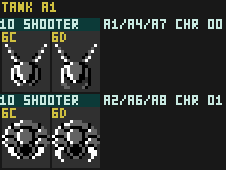

# Shooter

> ⚠️ **Alpha — not yet fully verified.** This page has been published for early
> access but has not completed human verification and may still contain errors.


The tank-section "Gray Shooter" (external name): a small enemy that is launched in a
random straight line, **bounces off walls**, and fires a Small Red shot at Sophia when it
happens to be aligned with her.



## Thing Type

`$10` (tank section) — appears in Areas 1, 2, 4, 6, 7, 8.

## ObjTypes

| ObjType | Handler | Role |
|---|---|---|
| `$76` | `ObjHandler_Tank_76_Shooter_Init` @ `$AFFC` | Init (one frame) |
| `$77` | `ObjHandler_Tank_77_Shooter_Main` @ `$B013` | Active |

Both are dual-entry stubs. The `$76` `+0` render entry (`$B012`) is a bare `RTS` (init draws
nothing); the `$77` `+0` entry jumps straight to the render/hit tail at `$B04B`, skipping the
movement/fire logic (used during screen fades). The `+3` bodies hold the real code.

## Shared framework

Descriptor **index `$10`** in `TankEnemy_DescTable` (`$A36A`), via the tank enemy shared system
(_shared-enemy-system.md):

| Field | Value | Meaning |
|---|---|---|
| desc[0] | `$03` | behavior flag → `$53` |
| desc[1] | `$10` (16) | HP |
| desc[2] | `$2C` | death drop = Health-x1 pickup |
| desc[3] | `$80` | drop-chance threshold (`RNG_State < $80`) |

## Init routine (`$AFFF`)

```
LDA #$10 : JSR $A2E9   ; TankEnemy_Init(desc $10): desc[0]→$53, $4F=0,
                       ;   CalcTilemapIndex, INC $46 → $77 (active)
JSR $EB71 : STA $47    ; Step_RNG (pseudo-random) → $47 = launch ANGLE
LDY #$14  : JSR $E1BD  ; angle($47) + speed(Y=$14) → velocity vector $4C/$4D
LDA #$00  : STA $52    ; clear fire-cooldown timer
RTS
```

**How the direction is decided.** `$E1BD` is the engine's *angle → velocity* routine. It treats
`$47` as an 8-bit heading (0–255 spanning a full circle) and `Y` as a speed magnitude. It looks
the heading up in the quarter-sine table at `$E202` — `$E1D2` (angle + `$40`, the cosine) for the
X component and `$E1D5` (the sine) for the Y component — scales each by the speed in `$E196`, and
stores `$4C` (X velocity) and `$4D` (Y velocity). Because `$47` comes from `Step_RNG`
(`$EB71`, a position/frame-derived pseudo-random byte), the **launch direction is random** while
the **speed is fixed** at magnitude `$14` (slow drift). This is the "flies in a line" behaviour.

## Movement & wall bouncing (`$B016`, each frame)

```
$42=$80 ; $43=$80     ; terrain-probe half-extents
JSR $DF68             ; advance + bounce
```

`$DF68` moves the object and **reflects its velocity off level geometry**. It calls the terrain
probe `$E083`, which returns a flags byte in `$9A`: **bit 7 = horizontal wall → negate `$4C`**
(X velocity), **bit 6 = vertical wall/floor → negate `$4D`** (Y velocity). The Shooter therefore
ricochets around the room, keeping its speed. (This is *not* gravity — it has no downward
acceleration.)

## When/how often it attacks (`$B021`–`$B045`)

Firing is gated by a cooldown, two aiming tests, and a further internal throttle:

1. **Cooldown**: if `$52 ≠ 0`, decrement it, force `$50 = 0` (recoil pose), and skip to render —
   no fire this frame.
2. When `$52 == 0`, evaluate the aiming gates:
   - `JSR $E0ED` → **signed X-distance to the player** (player_X − obj_X). `EOR $4C` then
     `BMI skip`: fire only when the sign of the X-distance matches the sign of the X-velocity —
     i.e. **only while drifting toward Sophia horizontally**.
   - `JSR $E0FA` → **signed Y-distance to the player**. `BMI skip`: fire only when the player is
     **at or below** the Shooter (non-negative Y-distance).
3. If both gates pass: `LDA #$3C : STA $A0 : JSR $DF36` spawns child ObjType **`$3C` (the "Small
   Red" projectile)** into a free slot. `$DF36` has its **own rate limiter**: it refuses unless
   `frame_counter $11 AND #$4C == 0` (bits 2,3,6 clear) **and** a fresh `RNG_State AND #$03 == 0`
   (¼ random) both hold, so even a well-aimed Shooter fires only sporadically.
4. On a successful spawn: `$52 = $10` → **16-frame cooldown** before the next attempt.

Net effect: at most one shot roughly every 16+ frames, only while roughly aimed at Sophia and
with a random throttle — irregular bursts rather than a steady stream.

## Damage / death (`$B04B` tail)

```
$40=$10 ; $41=$10     ; 16×16 hit/collision box
JSR $EF2B             ; ScreenPos_Compute + player-projectile overlap
  BEQ +               ;   on-screen → continue
  JMP $D7F8           ;   off-screen → despawn
LDA #$10 : JSR $A30A  ; TankEnemy_DamageCheck(desc $10): apply pending shot damage vs HP 16
  BEQ +               ;   alive → render
  JMP $A34D           ;   killed → TankEnemy_Defeat
```

`$EF2B` computes screen position (despawning if it scrolls off) and registers overlap with the
player's shots against the 16×16 box. `$A30A` subtracts accumulated damage from its 16 HP; on
death it jumps to the shared tail `$A34D → TankEnemy_SpawnDrop → SpawnBigExplosion` (`$9B8B`):
big explosion + SFX `$28`, and — gated by `RNG_State < $80` — a possible **Health-x1 (`$2C`)**
drop.

## Rendering (`$B065`)

```
LDA #$01 : JSR $E04E  ; OAM attr base = palette 1; horizontal flip by $4C (Xvel) sign
LDX #$6C : LDA $50 : BNE +  : INX   ; X = $6C if $50≠0, else $6D
+ TXA : JMP $F011     ; draw metasprite
```

Two poses: **`$6C`** = normal/searching (`$50 = 1`, shown when off cooldown), **`$6D`** = recoil,
shown during the 16-frame post-fire cooldown (`$50 = 0`). `$E04E` mirrors the sprite to match its
X travel direction.

## Projectile

The shot it fires is **Small Red** — ObjType `$3C`/`$3D` (init `$9FDA`, main `$9FF9`). A single
8×8 tile (`$25`, sprite sub-palette 0) stamped via `Sprite_Stage` (`$ECB4`) — **not** a
metasprite. The same projectile Jason fires on foot (see 1b-23_jason.md and
projectiles-ballistics.md).


## Maintainer Notes

- ObjType chain `$76 → $77` confirmed from the bank-06 dispatch table and disassembly.
- Helper semantics used above (verified by decoding bank 07): `$E0ED` = signed X-distance to
  player, `$E0FA` = signed Y-distance to player, `$E1BD` = angle(`$47`)+speed(Y) → velocity,
  `$DF68` = move + reflect velocity on wall collision, `$DF36` = rate-limited child spawn,
  `$E04E` = OAM attr/h-flip by X-velocity sign.
- Human verification of the tri-state status still pending.
