# Cut content

A registry of **cut content** — assets and code that exist in the shipped ROM but are
never reached/rendered in normal play. Each entry records *what* the content is, the
*static proof* that it's unreachable, and (where applicable) a committed, regenerable
script that reconstructs how it would have looked/sounded.

This is an index: several cut-content findings already live in their subsystem docs
(linked under [See also](#see-also)). New cut-content findings should be summarised here
with a pointer to the detailed doc.

## CHR ROM Bank 00 — cut metasprite frames `$0C` & `$0D`

Two tank metasprite definitions — `$0C` (def `$87F9`, CHR tiles `$CC $CD $CE $DC $DD $DE`) and
`$0D` (def `$880B`, CHR tiles `$CC $CD $CE $CF $DC $DD`) — read as the two frames of one small
armoured creature.  Judging by its animated arm extending far below it, this was likely meant to be a flying enemy.  It's possible this was an alternate design for the Flying Bomber which also only has two animation frames.

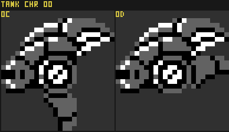

Animated mock-up releasing the Flying
Bomber's projectile (this is a
reconstruction, not proven behaviour):

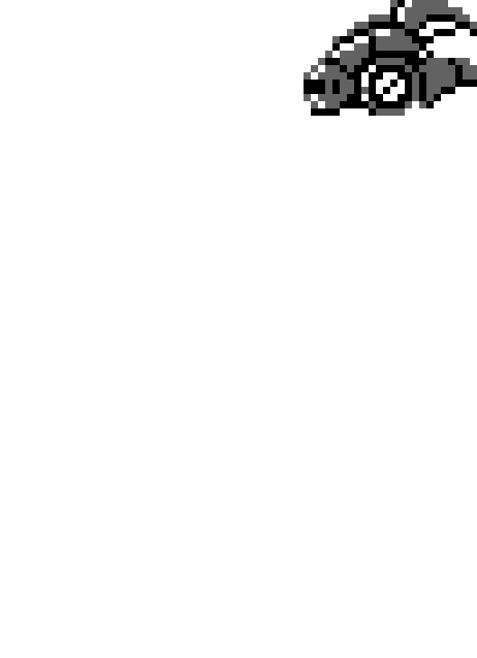

### Static Proof

`Trace6502 metasprite "<rom>" tank refs 0c-0d` reports both as `LIVE`, but that verdict is a
**false positive**: every immediate `LDA #$0C` / `LDA #$0D` in the tank handler bank (06) is a
**non-sprite** use — an ObjType morph (`STA $46`; ObjTypes `$0C`/`$0D` are *unrelated* handlers in
a different namespace), the literal `12` (animation-counter `$51` reload, hitbox `$40/$41`,
velocity `$4C/$4D`), a subroutine argument, or a `CMP`. Neither id is a nested sub-def, and neither
appears in any sprite-id table, so nothing ever loads `$0C`/`$0D` into the renderer (`$F011`). They
are flagged `DEAD_Metasprite_Tank_0C_Unused` / `DEAD_Metasprite_Tank_0D_Unused` in the labels. See
the full reasoning in
docs/entities/metasprite-system.md.

### Regenerate

```
bash scripts/chr-rom-explorations/unused-metasprites-0c-0d.sh
# → image-dumps/tank_unused_metasprites_0c_0d.png  (image-dumps/ is gitignored; the script is the source)
```

The committed copy under `docs/wip/img/` renders the pair `--gray` (white/gray/black — no sprite
sub-palette is recoverable for content that never renders) from CHR bank `$00` (tank areas
A1/A4/A7; the tiles are duplicated identically across the tank CHR banks):

```
dotnet run --project tools/Trace6502 -- metasprite "<rom>" tank sheet \
  --ids 0c,0d --chr-bank 00 --gray --scale 8 --cols 2 \
  --out docs/wip/img/chr-00_tank_cut-enemy_alt-bomber.png

# build the per-game-frame ballistic arc (dx = 4 - 3t leftward, dy = 14 + round(0.2 t²) gravity)
frames="0d"; delays="100"
for t in $(seq 0 18); do
  dx=$(( 4 - 3*t )); dy=$(awk -v t=$t 'BEGIN{printf "%d", 14 + int(0.2*t*t + 0.5)}')
  frames="${frames},0c+t6d@${dx}:${dy}"; delays="${delays},2"
done
dotnet run --project tools/Trace6502 -- metasprite "<rom>" tank gif "$frames" \
  --chr-bank 00 --gray --scale 8 --delay "$delays" \
  --out docs/wip/img/chr-00_tank_cut-enemy_alt-bomber.gif
```

The bomb is the `t6d` raw-tile part: a bare CHR tile `$6D` composited
onto body `$0C` via the `@dx:dy` offset. The offsets trace a **ballistic parabola** — `dx` steps
left by a constant `−3/frame` (forward velocity, the direction the enemy faces) while `dy`
accelerates as `≈0.2 t²` (gravity). `--delay 100` holds the loaded `$0D` pose ~1 s; the arc plays
one position per game-frame at `--delay 2` (≈50 fps — GIF's 1/100 s granularity can't express a
true 60 fps / 1.67 cs, and viewers clamp delays below 2 cs, so 2 cs is the smooth floor).

## CHR ROM Bank 01 — cut metasprite frames `$6E` & `$6F`

Two tank metasprite definitions — `$6E` (def `$8676`) and `$6F` (def `$8685`) — read as the two
frames of a **moai** (an Easter Island statue head) with an animated mouth. Their CHR tiles live in
tank CHR bank `$01` (tank areas A2/A6/A8).

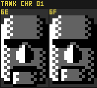

Animated (the two frames looped):

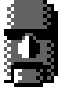

### Static Proof

`Trace6502 metasprite "<rom>" tank refs 6e-6f`:

| id | def | verdict |
|---|---|---|
| `$6E` | `$8676` | **UNREFERENCED** — no code touches it |
| `$6F` | `$8685` | **UNREFERENCED** — the only imm-loads are two in *other* banks, flagged "likely coincidental" (not the tank handler bank 06) |

Neither id is loaded as a sprite by any tank handler, is a nested sub-def, or sits in any sprite-id
table — no live code path renders the moai.

### Regenerate

The committed sheet and GIF render the two frames `--gray` (no sprite sub-palette is recoverable
for content that never renders) from CHR bank `$01`:

```
dotnet run --project tools/Trace6502 -- metasprite "<rom>" tank sheet \
  --ids 6e,6f --chr-bank 01 --gray --scale 6 --cols 2 \
  --out docs/wip/img/chr-01_tank_cut-enemy_moai.png

dotnet run --project tools/Trace6502 -- metasprite "<rom>" tank gif 6e,6f \
  --chr-bank 01 --gray --delay 24 --scale 6 \
  --out docs/wip/img/chr-01_tank_cut-enemy_moai.gif
```

## Area 5 — Tank — cut metasprite frames `$AB` — `$AF`

Five consecutive tank metasprite definitions read as an unused enemy: `$AB` (def `$88B2`) and
`$AC` (def `$88C3`) are the two 17-byte multi-tile **body** frames, while `$AD`
(def `$88D4`), `$AE` (def `$88D9`) and `$AF` (def `$88DE`) are 5-byte single-entry defs — small
appendages. The body tiles live in tank CHR bank `$02` (tank Area 5).

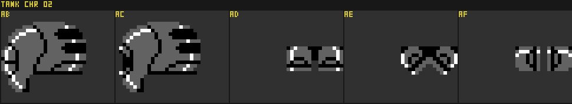

Animated (the five frames looped):

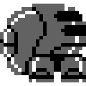

### Static Proof

`Trace6502 metasprite "<rom>" tank refs ab-af`:

| id | def | verdict |
|---|---|---|
| `$AB` | `$88B2` | **UNREFERENCED** (only "likely coincidental" imm-loads in other banks) |
| `$AC` | `$88C3` | **UNREFERENCED** — no code touches it |
| `$AD` | `$88D4` | **UNREFERENCED** (only "likely coincidental" imm-loads in other banks) |
| `$AE` | `$88D9` | **UNREFERENCED** — no code touches it |
| `$AF` | `$88DE` | **UNREFERENCED** (only "likely coincidental" imm-loads in other banks) |

None of the five is loaded as a sprite by any tank handler, is a nested sub-def, or sits in any
sprite-id table — no live code path renders this enemy.

### Regenerate

The committed sheet and GIF render the five frames `--gray` (no sprite sub-palette is recoverable
for content that never renders) from CHR bank `$02` (tank Area 5):

```
dotnet run --project tools/Trace6502 -- metasprite "<rom>" tank sheet \
  --ids ab,ac,ad,ae,af --chr-bank 02 --gray --scale 6 --cols 5 \
  --out docs/wip/img/area-5_tank_cut-enemy.png

dotnet run --project tools/Trace6502 -- metasprite "<rom>" tank gif ab,ac,ad,ae,af \
  --chr-bank 02 --gray --delay 24 --scale 6 \
  --out docs/wip/img/area-5_tank_cut-enemy.gif
```

## Area 8 final boss (phase 1) — cut metasprite frames `$57`–`$59`

Three overhead metasprite definitions — `$57` (def `$BBB9`), `$58` (def `$BBC3`) and `$59`
(def `$BBCD`) — sit inside the **Final Boss phase-1** id block (`$53`–`$5D`, CHR even bank `$10` /
odd bank `$1B`, boss palette from `$C6D7` area 8). They read as a tall, tapering brown spike — an
unused **boss projectile** distinct from the Egg Shot the boss actually fires (live tiles
`$5A`–`$5D`).

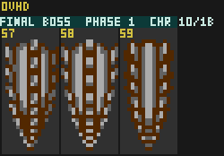

Animated (the three frames looped; a slowed copy beside it):

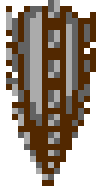


### Static Proof

`Trace6502 metasprite "<rom>" ovhd refs 57-59`:

| id | def | verdict |
|---|---|---|
| `$57` | `$BBB9` | **UNREFERENCED** — no code touches it |
| `$58` | `$BBC3` | reported `LIVE`, but the three hits (`$B4A4`/`$B617`/`$BF4D`) are all `LDA #$58 / STA $0400,X` — a **child-ObjType spawn** (spawning overhead ObjType `$58` = `ObjHandler_Ovhd_58_Gray_Gumdrop_Shot_Init`), **not** a sprite-id load |
| `$59` | `$BBCD` | **UNREFERENCED** — no code touches it |

So no live code path loads `$57`/`$58`/`$59` into the renderer. The `$58` "LIVE" verdict is the same
ObjType-vs-metasprite-id namespace collision noted for the phase-2 `$64` frame above — the byte
`$58` here names a spawned object, not a sprite.

### Regenerate

The committed sheet and GIFs use the phase-1 boss CHR (even bank `$10` / odd bank `$1B`) and the
`$C6D7` area-8 boss palette (`$07,$00,$10` = maroon / black / blue). The `_slow` GIF only widens
`--delay`:

```
dotnet run --project tools/Trace6502 -- metasprite "<rom>" ovhd sheet \
  --ids 57,58,59 --chr-bank 10 --chr-odd 1B --8x16 --palette 07,00,10 --scale 4 --cols 3 \
  --out docs/wip/img/area-8_ovhd_boss_phase-1_cut-projectile.png

dotnet run --project tools/Trace6502 -- metasprite "<rom>" ovhd gif 57,58,59 \
  --chr-bank 10 --chr-odd 1B --8x16 --palette 07,00,10 --delay 20 --scale 4 \
  --out docs/wip/img/area-8_ovhd_boss_phase-1_cut-projectile.gif

dotnet run --project tools/Trace6502 -- metasprite "<rom>" ovhd gif 57,58,59 \
  --chr-bank 10 --chr-odd 1B --8x16 --palette 07,00,10 --delay 60 --scale 4 \
  --out docs/wip/img/area-8_ovhd_boss_phase-1_cut-projectile_slow.gif
```

## Area 8 final boss (phase 2) — cut metasprite frames `$64`–`$66`

The Area 8 final boss phase-2 body (`ObjHandler_Ovhd_69_Area_8_Boss_Phase2_Main`, `$AC84`)
draws itself as `metasprite id = $5E + $0670`, where the frame index `$0670` is produced by
`Boss8_Phase2_ComputeAnimFrame` (`$ADE7`). Working out **every** reachable value of `$0670`
across all states and HP tiers (see the boss doc)
gives only:

- walk / telegraph → ids `$5E`–`$63`
- whip → ids `$67`–`$6F`

The three ids **`$64`, `$65`, `$66`** (frame indices 6, 7, 8) sit in the gap between the walk
block and the whip block and are **never produced by any state's formula** — even though each
has a valid metasprite definition (`$BC5F` / `$BC6E` / `$BC78`). They are an unused animation:
three full-body poses of the final boss, distinct from both the walk and whip frames.

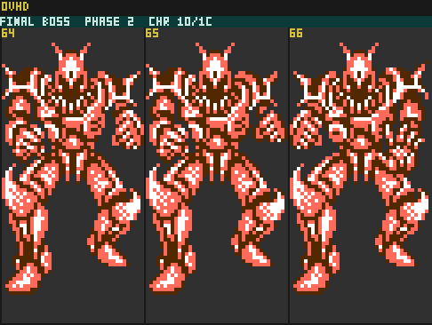

Animated (reconstruction, body lead-in + the cut tail):

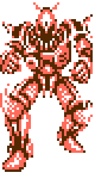

### Static proof (unreferenced)

`Trace6502 metasprite "<rom>" ovhd refs 64-66`:

| id | def | verdict |
|---|---|---|
| `$64` | `$BC5F` | the only code "hit" is a coincidental `CMP #$64` at `$9695` — a counter clamp (`CMP #$64 / BCC / LDA #$63 / STA $06F0,X`), **not** a sprite-id load |
| `$65` | `$BC6E` | **UNREFERENCED** — no code touches it |
| `$66` | `$BC78` | **UNREFERENCED** — no code touches it |

So no live code path ever loads `$64`/`$65`/`$66` into the renderer. They render with the
phase-2 sprite palette (flat `$07,$26,$30` = maroon / salmon / white) from CHR even bank
`$10` / odd bank `$1C`.

### Regenerate

```
bash scripts/chr-rom-explorations/area8-boss-cut-attack-gif.sh
# → image-dumps/area8_boss_cut_attack.gif  (image-dumps/ is gitignored; the script is the source)
```

The committed copies under `docs/wip/img/` are produced from that script and from:

```
dotnet run --project tools/Trace6502 -- metasprite "<rom>" ovhd sheet \
  --ids 64,65,66 --chr-bank 10 --chr-odd 1C --8x16 --palette 07,26,30 --scale 4 \
  --out docs/wip/img/area8-boss-cut-metasprites.png
```

## Area 8 final boss (phase 2) — cut **beam weapon** (CHR `$1C`)

The phase-2 boss CHR bank `$1C` holds a whole **cut beam weapon** the boss never fires. The
shipped phase-2 attack is the **Whip** (ObjType `$82/$83`, custom-staged tiles `$70/$71` down and
`$80/$81` down-left, mirrored for down-right); the bank also contains an unused beam that reads as
that whip's "energy" alternate — a charge-up plus two firing directions, all built from `$1C`
tiles that no phase-2 metasprite or the Cat0A background ever uses (they surface as **red/unused**
in `mapusage`'s `$1C` sheet). The reconstructions below render in the phase-2 boss palette
(`$07,$26,$30`); the per-frame **timing and assembly are a reconstruction**, not proven behaviour.

**Charge-up** — three frames: `$90/$91` and `$a0/$a1` are single centered tile-pairs (alternately
h-flipped for shimmer); `$a2/$a3` is mirror-doubled into the full charged ball. Oscillates 1↔2 then
2↔3 (a charging build-up):

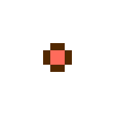

**Downward beam** — a 2×2 segment (`$10/$11` + `$20/$21`) that repeats downward like the whip,
capped by the `$ae–$bf` end; shown extending:

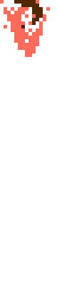

**Diagonal beam** — a 3×2 segment (`$30/$31` + `$40/$41` + `$50/$51`) with a `$60` connector 8px to
its left, repeating down-right, capped by the `$ac–$bd` end (also `$60`-led); shown extending:

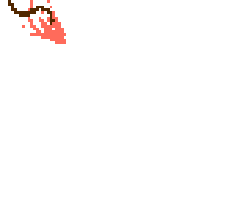

**Full attack mock-up** — the boss (poses `$64`/`$65`/`$66`) charges the beam at its raised left
hand (screen-right) over `$65`, then fires it from that hand over `$66`. Reconstructed as three
separate shots — down-left (diagonal, h-flipped), straight down, and down-right (diagonal) — each
extending out and then holding the full beam ~2 s. The charge/beam composite **in front** of the
body; the charge ball uses the **player sprite palette** (pal 0, white/red). Firing point,
directions and timing are a reconstruction.

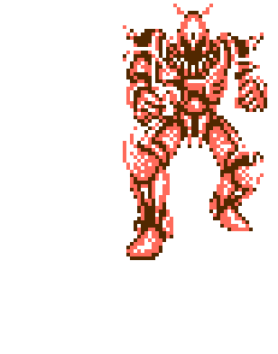
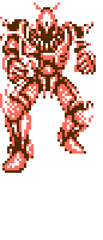
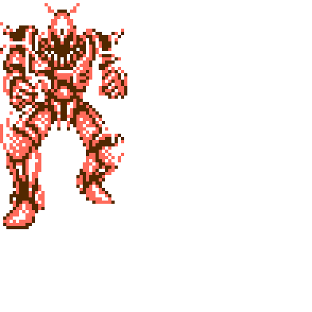

**Fantasy variant — animated palette.** Purely speculative: the beam given an animated palette it
never actually had. Area 8's phase-2 boss has no free sprite palette (pal 0 = player, 1 = grey gun
shots, 2 = boss, 3 = the animated charged-shot/damage palette), so this only works by "pretending".
The beam is tinted with the **global animated palette 3** — table `$C651` = `30 22 24 26 28 2A 30 26`,
whose three colours cycle in sync every frame (Ovhd/Tank run it at all times; it flashes charged
shots and damage). Here entry 1 = `table[f]`, entry 2 = `table[(f+4)&7]` (180° out of phase),
entry 3 = fixed `$30`, so the beam's "swirly bits" shimmer; the boss keeps its own palette and the
charge stays player-red (per-part palettes). The full-beam hold cycles rather than freezing.


### Static proof (unreferenced)

All the beam tiles (`$10–$21`, `$30–$51`, `$60`, `$90–$a3`, `$ac–$bf`) live in CHR `$1C` but are
drawn by **no** phase-2 boss metasprite (`metasprite ovhd findtile <t>` → none in the `$53`–`$6F`
range) and are **not** in the Cat0A boss-room background — `mapusage`'s "Final Boss (Area 8)
Sprite + BG CHR" pass lists them under `$1C` **unused**. (By contrast the whip tiles `$70/$71`,
`$80/$81` **are** drawn in-game — by the whip's custom tile-staging, not a metasprite — and are
folded into the phase-2 `seen` set as `ExtraSeen`.)

### Regenerate

These use the `gif` **raw-tile** part `t<tile>` with **in-place** flips (`h`) and pixel offsets
(`@dx:dy`); `t91+t91h@8:0` draws tile `$90/$91` beside its own mirror. CHR even/odd bank `$1C`,
8×16, phase-2 palette.

```
# Charge-up (f1/f2 centered + alternating flip, f3 mirror-doubled)
dotnet run --project tools/Trace6502 -- metasprite "<rom>" ovhd gif \
  "t91@4:0,ta1@4:0,t91h@4:0,ta1h@4:0,ta3+ta3h@8:0,ta1@4:0,ta3+ta3h@8:0,ta1h@4:0" \
  --chr-bank 1C --chr-odd 1C --8x16 --palette 07,26,30 --delay 7 --scale 8 \
  --out docs/wip/img/area-8_ovhd_boss_phase-2_cut-beam-charging.gif

# Downward beam, extending (segments fill in as the end-cap descends)
seg(){ echo "t11@0:$1+t21@8:$1"; }; end(){ echo "taf@0:$1+tbf@8:$1"; }
dotnet run --project tools/Trace6502 -- metasprite "<rom>" ovhd gif \
  "$(end 0),$(seg 0)+$(end 16),$(seg 0)+$(seg 16)+$(end 32),\
$(seg 0)+$(seg 16)+$(seg 32)+$(end 48),$(seg 0)+$(seg 16)+$(seg 32)+$(seg 48)+$(end 64)" \
  --chr-bank 1C --chr-odd 1C --8x16 --palette 07,26,30 --delay 6 --scale 5 \
  --out docs/wip/img/area-8_ovhd_boss_phase-2_cut-beam-down.gif

# Diagonal beam, extending down-right ($60-led segment + $60-led end cap, (16,16) pitch)
dseg(){ local p=$1; echo "t60@$((p-8)):$p+t31@$p:$p+t41@$((p+8)):$p+t51@$((p+16)):$p"; }
dend(){ local p=$1; echo "t60@$((p-8)):$p+tad@$p:$p+tbd@$((p+8)):$p"; }
dotnet run --project tools/Trace6502 -- metasprite "<rom>" ovhd gif \
  "$(dend 0),$(dseg 0)+$(dend 16),$(dseg 0)+$(dseg 16)+$(dend 32),\
$(dseg 0)+$(dseg 16)+$(dseg 32)+$(dend 48),$(dseg 0)+$(dseg 16)+$(dseg 32)+$(dseg 48)+$(dend 64)" \
  --chr-bank 1C --chr-odd 1C --8x16 --palette 07,26,30 --delay 6 --scale 4 \
  --out docs/wip/img/area-8_ovhd_boss_phase-2_cut-beam-diagonal.gif
```

The **full attack mock-ups** are produced by two committed scripts (each emits three gifs, copied
to `docs/wip/img/` and renamed):
- `scripts/chr-rom-explorations/beam_attack.sh` → the realistic version (`*-cut-beam-attack-*.gif`)
- `scripts/chr-rom-explorations/beam_attack_alt.sh` → the fantasy animated-palette version
  (`*-cut-beam-attack-alt-*.gif`)

Their `CHARGE_*` / `*_BEAM_*_OFFSET` vars position the charge ball and each beam at the boss's hand;
they composite the body metasprites `$64`/`$65`/`$66` with the beam raw-tiles (boss part listed last
so the beam renders in front). Colour is applied with the `gif` command's **per-part palette** — a
trailing `/c1.c2.c3` on a part gives it its own sprite sub-palette — so the charge ball can be
player-red while the boss keeps its palette; the alt script additionally varies the beam's per-part
palette per frame from the `$C651` animation table (`--palettes` gives a whole-frame palette list).

## See also

Cut content documented in detail elsewhere:

- **Pause-screen vehicle-upgrade overlays** (CHR bank `$15`) — a full set of overlay tiles
  meant to draw onto the Sophia illustration when an upgrade is collected; the shipped game
  draws ability text labels instead. See
  [docs/misc/pause-screen-dead-overlays.md](pause-screen-dead-overlays.md).
- **Orphaned metasprite compositions `$0C`/`$0D`** — likely cut. See
  docs/entities/metasprite-system.md.
- **`$16`/`$17` E-Canister pickup handler** — handler exists but is unreachable in normal
  play (DEAD). See docs/wip/missing-object-types.md.
