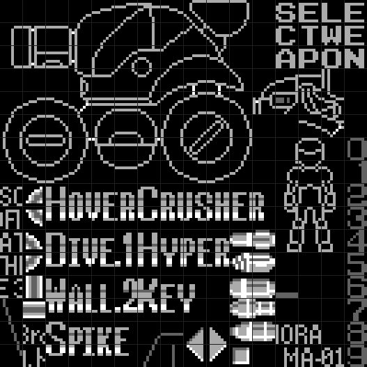
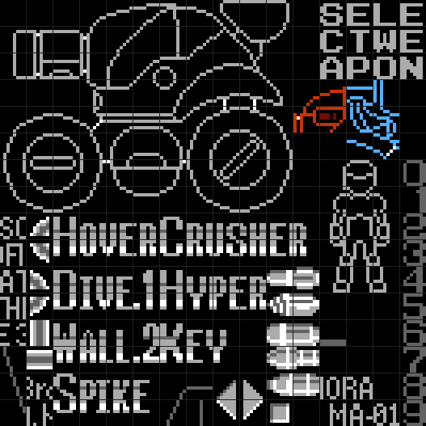
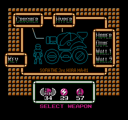
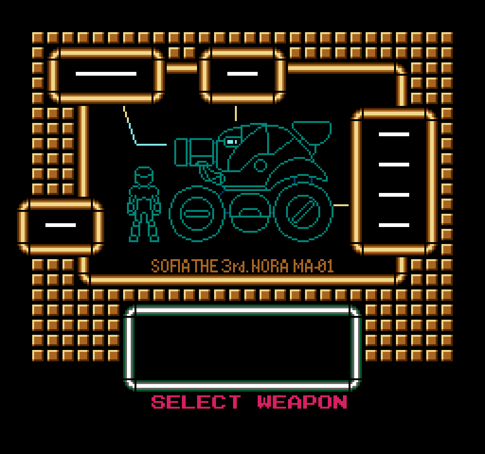

# Pause Screen — Dead Ability Overlay Tiles

## Summary

CHR bank `$15` contains cut content: graphical overlay tiles designed to be drawn directly onto the Sophia vehicle illustration in the pause-screen nametable when a vehicle upgrade is collected. In the shipped game these tiles go completely unused; the ability labels (text tiles) are drawn instead. The overlay tiles exist in the ROM alongside the text tiles and are reachable using the same `VramQueue_StageRow` + `VramQueue_Flush` pipeline — the only changes needed are the nametable position, descriptor, and tile index in the item data records at `$F985`–`$F98C`.

---

## CHR bank layout

The pause screen loads `CHR_BankLo ($D4) = $10` and `CHR_BankHi ($D5) = $15`.  
CHR bank `$15` is the **background** pattern table (PPU `$1000–$1FFF`); all nametable tile indices reference it.

Every block below is a **rectangular sub-image of the 16-tile-wide atlas**: from the top-left
tile, step **`+$10` per column** (to the right) and **`+1` per row** (down). Size is given as
*width × height* in tiles. (So the 2×2 at `$B3` is `$B3 $C3` over `$B4 $C4`.)

| Top-left tile | Size (W×H) | Contents |
|---|---|---|
| `$28` | 4×2 | HOVER label (bit 0) |
| `$2A` | 3×2 | DIVE label (bit 1) |
| `$2C` | 4×2 | WALL 1 / WALL 2 labels (bits 2/3 — same rect; differ only in the last-column digit tile) |
| `$2E` | 5×2 | SPIKE label (bit 5) — glyphs exist but are **never drawn**: bit 5's record is a sentinel |
| `$68` | 6×2 | CRUSHER label (bit 4) |
| `$6A` | 4×2 | HYPER label (bit 6) |
| `$6C` | 3×2 | KEY label (bit 7) |
| `$B3` | 2×2 | **Dead overlay A** — drawn for the CRUSHER record (bit 4) via GG |
| `$D3` | 2×3 | **Dead overlay B** — drawn for the HYPER record (bit 6) via GG |

The remaining tiles are border/frame tiles, the Sophia vehicle illustration, a
Jason illustration, lines, text characters, digits, some unused UI elements, and some unused weapon images.

Generate the bank sheet: `dotnet run --project tools/Trace6502 -- chrsheet us 15 --col-major`

The two dead overlays are the small mechanical tiles at the top-right of the sheet. Overlay A (drawn for the CRUSHER record) is the 2×2 block `$B3 $C3 / $B4 $C4`; overlay B (HYPER record) is the 2×3 block `$D3 $E3 / $D4 $E4 / $D5 $E5`. The annotated sheet highlights them (red = overlay A, cyan = overlay B):

| Bank `$15` (col-major) | Overlays highlighted |
|:---:|:---:|
|  |  |

Which upgrade each overlay was *designed* for is not certain — the overlay tiles are dead CHR (no live code or data references them), so the pairing above follows the item record each Game Genie demo redirects, not an intrinsic ROM link.

---

## VramQueue descriptor format

`VramQueue_StageRow ($E797)` reads one descriptor byte followed by tile indices from `($7A)`.

| Bits | Field | Notes |
|---|---|---|
| bit 7 | auto-tile | 1 = increment tile index each row; 0 = explicit per-row tile list follows |
| bits 6:4 | tile count per row | number of tile columns written per row |
| bits 3:0 | row count | number of nametable rows written |

Examples:
- `$C2` = `1 100 0010` → auto, 4 tiles wide, 2 rows tall
- `$A2` = `1 010 0010` → auto, 2 tiles wide, 2 rows tall (overlay A, CRUSHER record)
- `$A3` = `1 010 0011` → auto, 2 tiles wide, 3 rows tall (overlay B, HYPER record)
- `$E2` = `1 110 0010` → auto, 6 tiles wide, 2 rows tall (CRUSHER text label)

---

## PauseScreen_DrawItems item table (fixed bank, $F96F)

### Pointer structure

`$F96F/$F970` holds a LE16 pointer to the sub-table at `$F971`.  
`$F971` holds 8 × LE16 pointers to individual item records (indexed by `PauseScreen_SophiaPowerUps` bit position × 2).

### Item records — all 8 entries

Each `PauseScreen_SophiaPowerUps ($99)` bit gates one record. All eight labels were read by rendering
every record's tiles at once (equivalent to `$99 = $FF`) with
`tools/Trace6502 -- nametable`; the word in the **Label** column is what that record actually
draws on-screen.

| Bit | Record ptr | col | row | Descriptor | First tile | **Label (rendered)** |
|---|---|---|---|---|---|---|
| 0 | `$F981` | 24 | 8  | `$C2` auto 4w×2t | `$28` | **HOVER** |
| 1 | `$F98D` | 24 | 10 | `$B2` auto 3w×2t | `$2A` | **DIVE** |
| 2 | `$F991` | 24 | 12 | `$42` non-auto 4w×2t | `$2C…$5A$5B` | **WALL 1** |
| 3 | `$F99C` | 24 | 14 | `$C2` auto 4w×2t | `$2C` | **WALL 2** |
| 4 | `$F989` | 4  | 4  | `$E2` auto 6w×2t | `$68` | **CRUSHER** |
| 5 | `$F9A4` | — | — | `$80` sentinel | — | **SPIKE** — unimplemented, no-op |
| 6 | `$F985` | 14 | 4  | `$C2` auto 4w×2t | `$6A` | **HYPER** |
| 7 | `$F9A0` | 2  | 14 | `$B2` auto 3w×2t | `$6C` | **KEY** |

The status screen with every upgrade collected (`PauseScreen_SophiaPowerUps = $DF`):

There are **no additional or unidentified entries** — all eight bits now resolve to a label.
Bit 2 (WALL 1) is the only **non-auto** record: it shares the `WALL.` prefix tiles with bit 3
(WALL 2) but substitutes the "1" digit tiles (`$5A/$5B`) into its explicit tile list where the
auto record would step to the "2" digit (`$5C/$5D`). Item 5 (SPIKE) was added during NA
localisation but never completed; its sentinel byte ensures it is always skipped.

---

## Changing which upgrades you have (RAM)

`PauseScreen_SophiaPowerUps ($0099)` is the collected-upgrades bitfield — one bit per record above, in the
same bit order. Setting a bit marks that upgrade "collected", so it shows on the pause screen
and its ability is enabled in tank physics (e.g. the WALL bits gate wall-climb; see
`docs/execution-flow/07-sophia-physics.md`). To change loadout live, write `$0099`:

| Bit | Value | Upgrade |
|---|---|---|
| 0 | `$01` | HOVER |
| 1 | `$02` | DIVE |
| 2 | `$04` | WALL 1 |
| 3 | `$08` | WALL 2 |
| 4 | `$10` | CRUSHER |
| 5 | `$20` | SPIKE (unimplemented — label skipped, no ability) |
| 6 | `$40` | HYPER |
| 7 | `$80` | KEY |

Write `$FF` (or `$DF` to leave the dead SPIKE bit clear) to `$0099` to grant everything. Ammo
counts are a separate structure drawn by `PauseScreen_DrawAmmo ($F9A5)`, not part of this byte.

---

## Overlay tile positions on the nametable

The Sophia illustration is decompressed from bank-03 category 0 into nametable `$2000`. The overlay tiles are sized and positioned to composite correctly onto the illustration:

| Record (bit) | Overlay tile | Size | Nametable col | Nametable row | PPU address |
|---|---|---|---|---|---|
| CRUSHER (bit 4) | `$B3` | 2 wide × 2 tall | 14 | 8 | `$210E` |
| HYPER (bit 6) | `$D3` | 2 wide × 3 tall | 13 | 10 | `$214D` |

These positions are 4–5 rows below the text labels. Both screens below use the real pause-screen
palette (`$F917`, loaded by `PauseScreen_LoadPalette`) and the screen's own attribute table. In the
"after" image the CRUSHER overlay (`$B3`) shows as a cannon/barrel detail on the upper hull and the
HYPER overlay (`$D3`) as an arm/claw on the front; blank overlay tiles are left transparent (the
shipped game's opaque draw would stamp the background colour there — the `$B3` overlay's right
column `$C3/$C4` is only partly drawn):

| Shipped (no overlays) | With the dead overlays |
|:---:|:---:|
|  |  |

Both composites were produced statically with `dotnet run --project tools/Trace6502 -- nametable --pause-palette`. The overlays are never drawn by the shipped game, so seeing them in-engine requires the Game Genie record patches below.

---

## Game Genie codes to activate the overlays

These codes redirect PauseScreen_DrawItems to write overlay tiles instead of text labels for the CRUSHER and HYPER records. Enter all 8 before opening the pause screen. (Item 4 is the CRUSHER record; item 6 is HYPER.)

### CRUSHER record (bit 4) → `$B3` overlay (2×2, nametable col=14 row=8)

Patches item 4 record at `$F989–$F98C`:

| Code | Address | Change | Effect |
|---|---|---|---|
| `TEANOPGE` | `$F989` | col `$04` → `$0E` | move to col 14 |
| `AEANXPGE` | `$F98A` | row `$04` → `$08` | move to row 8 |
| `XXANUPXT` | `$F98B` | desc `$E2` → `$A2` | 2 wide × 2 tall |
| `UUANKOAT` | `$F98C` | tile `$68` → `$B3` | overlay tile |

### HYPER record (bit 6) → `$D3` overlay (2×3, nametable col=13 row=10)

Patches item 6 record at `$F985–$F988`:

| Code | Address | Change | Effect |
|---|---|---|---|
| `IEAYSOTE` | `$F985` | col `$0E` → `$0D` | move to col 13 |
| `ZEAYVPGE` | `$F986` | row `$04` → `$0A` | move to row 10 |
| `UXAYNPXG` | `$F987` | desc `$C2` → `$A3` | 2 wide × 3 tall |
| `USANEOZT` | `$F988` | tile `$6A` → `$D3` | overlay tile |
