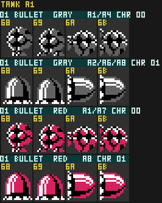

# Gray Bullet

A simple enemy that walks along surfaces and wraps around corners onto walls and ceilings.
The player passing over its head (according to current orientation) will cause it to buzz and launch itself away from its surface.

## Variants

The A variant attempts to latch itself to a platform to its left or right, depending on its spawning x-position.
The B variant attempts to latch itself to a platform above or below it, depending on its spawning x-position.

## Thing types / ObjTypes

| Thing Type | ObjType | Handler | Notes |
|---|---|---|---|
| `$01` | `$56` | `ObjHandler_Tank_56_Gray_Bullet_A_Init` @ `$A4DE` | Init.  Advances to `$59` |
| `$02` | `$58` | `ObjHandler_Tank_58_Gray_Bullet_B_Init` @ `$A50E` | Init.  Advances to `$59` |
| `$01`, `$02` | `$59` | `ObjHandler_Tank_59_Gray_Bullet_Main` @ `$A53A` | Main / Walking |
| `$01`, `$02` | `$5A` | `ObjHandler_Tank_5A_Gray_Bullet_Attacking` @ `$A5C2` | Attacking |

## Spawn Areas

Areas 1, 2, 4, 6, 7, 8

## Behaviour

The A and B variants differ only in their initial orientation.  Both converge on the same Walking `$59`.

Movement speed of `1.0` px/frame.

1. **Init (`$56` / `$58`).** Special logic to set up Facing and Orientation.
2. **Walking (`$59`).** Walk along surfaces and wrap around corners.
3. **Attacking (`$5A`).** Pauses briefly to buzz and then launches itself.

## Fields
| Name | State | Description | Format |
| --- | --- | --- | --- |
| `Facing`   | | Heading | 8-bit heading |
| `Scratch0` | | `Orientation` | 8-bit heading |
| `Scratch1` | Walking | `CornerWrapCooldown` | |
| `Scratch1` | Attacking | `AttackWindUpCounter` | |

## Maintainer Notes

Initial latching direction and how `Facing` + `Orientation` work are currently best guesses.  Needs dynamic confirmation.
