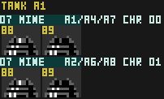

# Mine

Stationary or slow-moving explosive enemy.

## Thing Type

`$07` (tank section) — appears in all Areas

## ObjTypes

| ObjType | Handler | Role |
|---|---|---|
| `$64` | `ObjHandler_Tank_64_Mine_Init` @ `$A9CB` | Init |
| `$65` | `ObjHandler_Tank_65_Mine_Main` @ `$A9DE` | Main |

## Spawn Areas

Areas 1, 2, 4, 6, 7, 8

## Projectile

The shrapnel it throws (per `object_types.lua`): **Mine Shrapnel** — `Ballistic: Medium Red ; Mine Shrapnel`, ObjType `$44`/`$45` (Main `$A1AD`).

A single 8x8 CHR pattern (`$54`, sprite palette 0) stamped via `OAM_Stage_Pattern`.

## Fields

* `Scratch0`
  * It looks like this was originally meant to be a flag that kept track of whether the mine was falling or grounded.  If falling, gravity and collisions checks would be applied.  If grounded, a simpler terrain check would be applied.  This was, presumably, a performance optimisation to avoid running both checks every frame when only one was actually needed.  The grounded check also handles the cases when a mine is on a breakable block and that is broken.  Unfortunately, this flag's update logic is bugged and quickly goes into a bad state.
    * My guess is that the devs knew this was broken and decided to place all mines on solid, unbreakable ground to avoid the issue.
    * In its current state, the "falling" code (gravity applied to velociy, velocity applied to position, collision checks, and collision compensation) runs every frame, even when the mine is grounded.

## Maintainer Notes

Handler label names are from the pre-swap era. On defeat: transitions to ObjType `$2E`. Human verification pending.
