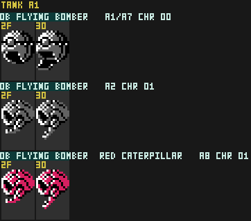

# Flying Bomber

Airborne enemy that drops bombs.

## Thing Type

`$0B` (tank section) — appears in Areas 1, 2, 7

## ObjTypes

| ObjType | Handler | Role |
|---|---|---|
| `$6C` | `ObjHandler_Tank_6C_Flying_Bomber_Init` @ `$AC3C` | Init |
| `$6D` | `ObjHandler_Tank_6D_Flying_Bomber_Main` @ `$AC63` | Main |

## Spawn Areas

Areas 1, 2, 7

## Fields
| Name | Description |
| --- | --- |
| `Facing`   | format:  8-bit heading
| `Scratch0` | `HasFired` flag (1 = fired, 0 = otherwise) |
| `Scratch1` | Bomb drop cooldown |
| `Scratch2` | Angle delta applied to Facing during post-attack swoop up. |
