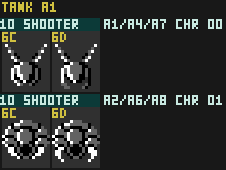

# Shooter

The tank-section "Shooter": a small enemy that is launched in a random straight line, bounces off walls, ceilings, and floors, and fires a Small Red shot at the player when approaching the player from above.

## Thing Type

`$10` (tank section) — appears in Areas 1, 2, 4, 6, 7, 8.

## ObjTypes

| ObjType | Handler | Role |
|---|---|---|
| `$76` | `ObjHandler_Tank_76_Shooter_Init` @ `$AFFC` | Init (one frame) |
| `$77` | `ObjHandler_Tank_77_Shooter_Main` @ `$B013` | Active |

## When/how often it attacks

Firing is gated by a cooldown, two aiming tests, and a further internal throttle:

1. If `ShotCooldown > 0`, decrement it, force `PoseIndex = 0` (default pose), and skip to render code.
2. When `ShotCooldown == 0`, evaluate the attack conditions:
   - Is the Shooter moving toward the Player on the x-axis?
   - Is the Shooter level with or above the Player?
3. If both conditions pass, spawn a "Small Red" projectile (ObjType `$3C`) into a free slot.
   
   **Note:** The spawn routine used has its own rate limiting rules and refuses to spawn unless `Global_FrameCounter & #$4C == 0` (bits 2, 3, 6 clear) **and**
   `Step_RNG() & $03 == 0` (¼ random) both hold, so even an in-range Shooter attacks only
   sporadically.
4. On a successful spawn, set `ShotCooldown = $10`.

Net effect: At most one shot roughly every 16+ frames and only when positioned correctly and with a random throttle.   In other words, the Shooter's attack pattern is irregular.

## Projectile

The shot it fires is **Small Red** (ObjType `$3C`/`$3D`).A single 8x8 CHR pattern (`$25`, sprite palette 0) stamped via `OAM_Stage_Pattern` 

## Fields

| Name | State | Description | Format |
| --- | --- | --- | --- |
| `Scratch0` | Main | `PoseIndex` | |
| `Scratch2` | Main | `ShotCooldown` | |

## Maintainer Notes

Nothing atm.
